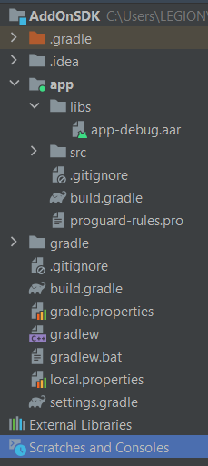
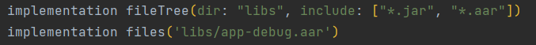
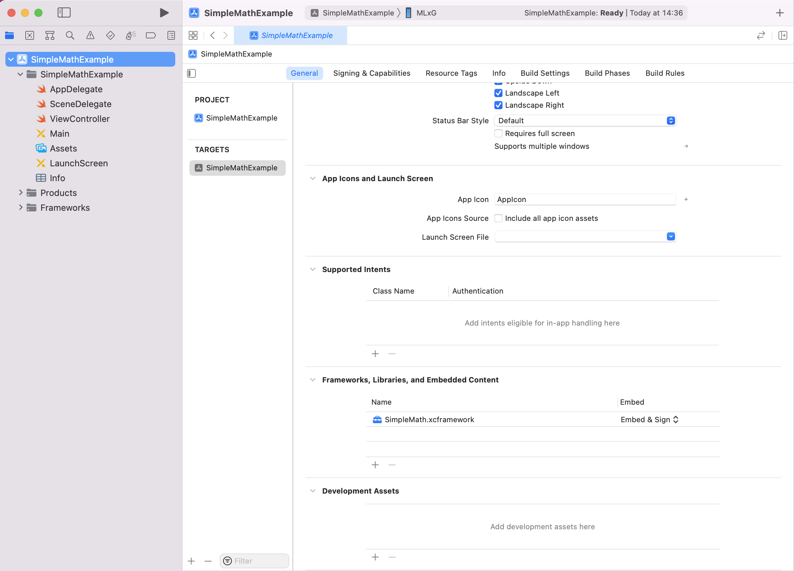

# Anypass SDK


The Anypass SDK makes it quick and easy to build an app with phone number verification, sms, change phone number. We provide low-level APIs to use these features.

Table of contents
=================

<!--ts-->
   * [Features](#features)
	   * [Android features](#android-features)
	   * [IOS features](#ios-features)
	   * [General features](#general-features)
   * [Releases](#releases)
   * [Installation](#installation)
      * [Requirements](#requirements)
      * [Configuration](#configuration)
	      * [Android config](#configuration)
	      * [IOS config](#configuration)
   * [Getting Started](#getting-started)
	   * [Public API](#public-api)
		   * [Android Kotlin](#android-kotlin)
		   * [IOS Swift](#ios-swift)
   * [Examples](#examples)
<!--te-->

## Features

### Android features
**Phone number verification**: automatically get the device's phone number if allowed by the user, then verify this phone number and return the result. 

### IOS features
**SMS authentication**: Confirm phone number via sending sms.

### General features
**Transfer (without phone number change)**: transfer your account without change the phone number

**Transfer (with phone number change)**: transfer your account and change your phone number

## Releases
* The [changelog](CHANGELOG.md) provides a summary of changes in each release.
* The [migration guide](MIGRATING.md) provides instructions on upgrading from older versions.

## Installation

### Requirements
#### Android
* Android 6.0 (API level 23) and above

#### IOS
* IOS 11 and above
* Swift 5.0 and above or objective C

### Configuration
**Android config**
Import anypass_sdk.jar into your project.

- Example: (app-debug.aar)
1. Add file to folder app/libs. 

2. Add a path to the dependency in your app [build.gradle](https://developer.android.com/studio/build/dependencies#using-native-dependencies)file

 
**IOS config**
Add your xcframework file you have just created by dragging and dropping it in Framworks, Libraries, and Embedded Content.



## Getting Started

### Public API

> #### Android Kotlin

| Function | Description |  Input  |
|--|--|--|
| verifyAndroidPhoneNumber | verify phone number.| Domain,DomainApiVerifyPhone |
| transferAccountWithoutChangePhoneNumber | transfer your account without change the phone number |Domain,DomainApiVerifyPhone|
| transferAccountWithChangePhoneNumber | transfer your account and change your phone number |Domain,DomainApiVerifyPhone|

1.  Create Launcher for start SDK

```kotlin
private val launcher = AnyPassSDK.createResultLauncher(this)

```

2.  Create SDK Builder and Start SDK

```kotlin
AnyPassSDKBuilder(this) // Set your callback listener here
                      .setDomain("YOUR_WEB_DOMAIN") // Set your domain here
                      .setApiVerifyPhone("YOUR_API_DOMAIN") // Set your ApiVerifyPhone here
                      .start(launcher, this) // start with launcher and activity

```

3.  Load WebView URL feature

-   Verify Android Phone Number

```kotlin
AnyPassSDK.verifyAndroidPhoneNumber()

```

-   Transfer account without Change Phone Number

```kotlin
AnyPassSDK.transferAccountWithoutChangePhoneNumber()

```

-   Transfer account with Change Phone Number

```kotlin
AnyPassSDK.transferAccountWithChangePhoneNumber()

```

4.  Callback Listener

```java
class MainActivity : AppCompatActivity(), ClientEventListener {

		override fun didAuthFail(sdkCode: String, msg: String) {

		}

		override fun didAuthSuccess(sdkCode: String?, msg: String?) {

		}
}

```

 <br /> <br />

> #### IOS Swift
| Function | Description |Input|
|--|--|--|
| verifyIosSms | Confirm phone number via sending sms. | domainURL |
| transferAccountWithoutChangePhoneNumber | transfer your account without change the phone number |domainURL|
| transferAccountWithChangePhoneNumber | transfer your account and change your phone number |domainURL|

1.  Initialize SDK

```swift
let config = AnyPassConfig(viewController: self, domainURL: "YOUR_WEB_DOMAIN")
let authentication = AnyPassAuthentication(with: config)
authentication.delegate = self

```

2.  Features

-   Verify sms

```swift
authentication.verifyIosSms()

```

-   Transfer account without change phone number

```swift
authentication.transferAccountWithoutChangePhoneNumber()

```

-   Transfer account with change phone number

```swift
authentication.transferAccountWithChangePhoneNumber()

```

3.  Delegates

```swift
extension ViewController: AnyPassAuthDelegate {
    func didAuthSuccess(userInfo: AnyPassResult) {
        
    }
    
    func didAuthFailure(error: AnyPassResult) {
        
    }
}

```

<br/><br/>

#### `statusCodes`

These are useful when determining which kind of error has occurred during process.

| Name                          | Description                                                                                                                                                                                                                                                                                                                                                               |
| ----------------------------- | ------------------------------------------------------------------------------------------------------------------------------------------------------------------------------------------------------------------------------------------------------------------------------------------------------------------------------------------------------------------------- |
| `NG_ERROR`           | API related errors                                                                                                                                                                                                                                                                                                                                       |
| `OK_USER_REGISTRATION`                 | Registration of ticketing information is complete.|
| `OK_USER_TRANSITION`            | Transfer of ticketing information has been completed.                                                                                                                                                                                                                                                                                                |
| `NG_NOTHING_TRANSFERER` | There is no transfer source registration information.                                                                                                                                                                                                                                                                 |
| `NG_SYSTEM_ERROR` | A system error has occurred.                                                                                                                                                                                                                                                                                        |

### Examples
-  [Kotlin example project](example/kotlin) 
-  [Swift example project](example/swift) 

## Licence

(copyright?? Waiting for confirm)
